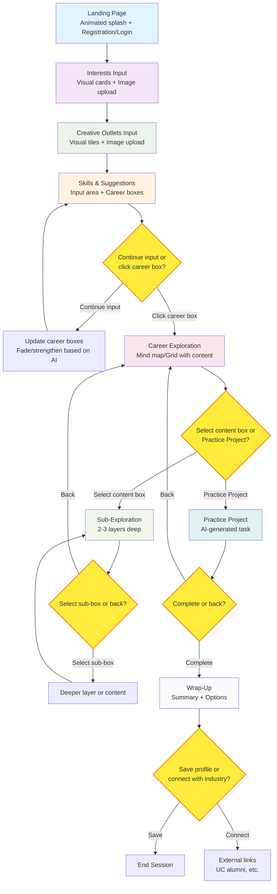

# Industrial Design Career Explorer Interface - Flowchart

## Legend

- **Blue nodes**: Entry points and main screens
- **Colored nodes**: Different functional areas
- **Yellow diamonds**: Decision points where users make choices
- **Arrows**: User flow and navigation paths

## Key Features

- **Smooth transitions** between all screens with animations
- **AI-powered suggestions** that update based on user input
- **A/B testing** for Career Exploration (mind map vs. grid)
- **Feedback loops** with sliders to refine AI outputs
- **Mobile-responsive** design throughout
- **MongoDB Atlas** integration for content storage
- **Google Analytics** tracking for engagement metrics

## Animation Notes

- Landing Page: Smooth fade-in for assets
- Interest Cards: Zoom in on hover
- Creative Tiles: Glow when selected
- Career Boxes: Adjust opacity based on AI confidence, hover scales
- Screen Transitions: Left-to-right slides, fades for conversational feel
